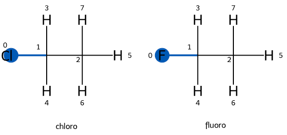

# 🧩 Understanding the HybridTopologyFactory (HTF)

> "You poor unfortunate soul!"

So, you’ve been tasked with understanding how the **HybridTopologyFactory (HTF)** works in `openfe` — may the odds be ever in your favor.  
This guide aims to help you (and future developers) navigate the inner workings of the HTF, using clear examples and annotated explanations that trace how it constructs a hybrid `OpenMM` system.

We’ll start with two representative examples — one **without ghost atoms** and one **with ghost atoms** — which together illustrate most of the HTF’s behavior.  
Throughout, we’ll reference the relevant sections of code that perform key steps in building the hybrid system.

**Note** The examples are based on the `openff-2.2.1.offxml` small molecule force field, so if the smirks types are updated or changed in future versions the number of interpolated parameters may change but the logic remains the same.

---

# 🧪 Example 1: Transformation *Without* Gohst Atoms

In this first example, we consider a simple, perfectly aligned transformation:

Chloroethane (CH3CH2Cl) ⟶ Fluoroethane (CH3CH2F)




All atoms are mapped directly between the two molecules, so no ghost atoms are introduced.

## Expected Behavior

Before diving into the HTF internals, it’s useful to outline what we expect the **final hybrid OpenMM system** to contain.  
Because every atom in the initial and final states is mapped, we expect:

- **No ghost atoms** (no atoms appear or disappear).  
- **Interpolated parameters** across all forces — As there is a one-to-one mapping for all valence and nonbonded terms they should be interpolated between the end state reference values in custom forces.

We can also list the expected forces in the final system and the terms they should contain:

| Force Type            | Expected Terms                                                                                                  |
|-----------------------|-----------------------------------------------------------------------------------------------------------------|
| HarmonicBondForce     | Constant bond parameters between end states                                                                     |
| CustomBondForce       | Interpolated bond parameters                                                                                    |
| HarmonicAngleForce    | Constant angle parameters between end states                                                                    |
| CustomAngleForce      | Interpolated angle parameters                                                                                   |
| PeriodicTorsionForce  | Constant proper and improper torsion parameters                                                                 |
| CustomTorsionForce    | Interpolated proper and improper torsion parameters                                                             |
| NonbondedForce        | Interpolated and constant electrostatic terms, Lennard-Jones interactions in the environment and 1-4 exceptions |
| CustomNonbondedForce  | Interpolated and constant Lennard-Jones parameters using the soft-core potential                                |
| CustomBondForce (1-4) | Interpolated 1-4 Lennard-Jones and electrostatic parameters for (1-4) exceptions using soft-core potential      |

This provides a reference checklist we can compare against what the HTF actually builds.

## What the HTF Does

Now, let’s walk through the HTF’s construction process step-by-step, highlighting key code sections. The construction of the hybrid system and topology occurs in the `HybridTopologyFactory.__init__` method.

## Bond Terms

1. The HTF adds the required forces to the hybrid system in the [_add_bond_force_terms](https://github.com/OpenFreeEnergy/openfe/blob/fcf0229c899666c896fe3940a85bd27942772235/openfe/protocols/openmm_rfe/_rfe_utils/relative.py#L196) method. This method adds two forces for the hybrid system — a `CustomBondForce` (stored in `self._hybrid_system_forces['core_bond_force']`) for interpolated bonds and a `HarmonicBondForce` (stored in `self._hybrid_system_forces['standard_bond_force']`) for constant bonds.
2. The HTF then adds the terms to these forces in the [_handle_harmonic_bonds](https://github.com/OpenFreeEnergy/openfe/blob/fcf0229c899666c896fe3940a85bd27942772235/openfe/protocols/openmm_rfe/_rfe_utils/relative.py#L1027). The valence term adding algorithm is very similar across all forces and follows this general pattern:
   - Iterate over all terms in the old system force
   - For each term, check if it is a **mapped interaction** (i.e., present in both end states).
   - If mapped, add to the `CustomForce` with interpolated parameters - even if the parameters do not change between the end states.
   - If unmapped/unique, add to the `StandardForce` with constant parameters from the relevant end state.
   - Then repeat for the new system force adding any unique terms.
   - All environment terms are added to the `StandardForce`.

So for the example above (CH3CH2Cl ⟶ CH3CH2F), all bonds are mapped, and so they are added to the `CustomBondForce` with interpolated parameters. 

**Note** that due to the use of hydrogen bond constraints only two harmonic bonds exist in the hybrid system (C-Cl/F and C-C) and no normal bonds are present. An excerpt of the resulting `CustomBondForce` is shown below:

```xml
<Force energy="(K/2)*(r-length)^2;K = (1-lambda_bonds)*K1 + lambda_bonds*K2;length = (1-lambda_bonds)*length1 + lambda_bonds*length2;" forceGroup="0" name="CustomBondForce" type="CustomBondForce" usesPeriodic="0" version="3">
    <PerBondParameters>
        <Parameter name="length1"/>
        <Parameter name="K1"/>
        <Parameter name="length2"/>
        <Parameter name="K2"/>
    </PerBondParameters>
    <GlobalParameters>
        <Parameter default="0" name="lambda_bonds"/>
    </GlobalParameters>
    <EnergyParameterDerivatives/>
    <Bonds>
        #                   length1                     K1                          length2                     K2
        <Bond p1="0" p2="1" param1=".18020307897979998" param2="101834.95358115867" param3=".1359259268774"     param4="240880.56126271648"/>
        <Bond p1="1" p2="2" param1=".15336821898359998" param2="180110.90173344052" param3=".15336821898359998" param4="180110.90173344052"/>
    </Bonds>
</Force>
```
We can also check the parameters in the force programmatically to confirm they match the parameters assigned by the OpenFF small molecule force field:

```python
# load the same force field and label the molecules
ff = ForceField("openff-2.2.1.offxml")
chloro_labels = ff.label_molecules(chloro.to_openff().to_topology())[0]
fluoro_labels = ff.label_molecules(fluoro.to_openff().to_topology())[0]

# get the hybrid system and forces
hybrid_openmm_system: openmm.System = hybrid_factory.hybrid_system
forces = {force.getName(): force for force in hybrid_openmm_system.getForces()}

# for each bond in the force check the end state values against the labels
custom_b_force = forces["CustomBondForce"]
for i in range(custom_b_force.getNumBonds()):
    p1, p2, parameters = custom_b_force.getBondParameters(i)
    # p1 and p2 are the index in chloroethane get the expected bond parameters
    chloro_bond = chloro_labels["Bonds"][(p1, p2)]
    # make sure the initial parameters correspond to the expected values
    # convert to openmm internal units
    assert parameters[0] == chloro_bond.length.m_as(offunit.nanometers)
    assert parameters[1] == chloro_bond.k.m_as(offunit.kilojoule_per_mole/ offunit.nanometer**2)
    # now check the expected fluoro parameters
    # map the index first
    f1 = mapping.componentA_to_componentB[p1]
    f2 = mapping.componentA_to_componentB[p2]
    fluoro_bond = fluoro_labels["Bonds"][(f1, f2)]
    assert parameters[2] == fluoro_bond.length.m_as(offunit.nanometers)
    assert parameters[3] == fluoro_bond.k.m_as(offunit.kilojoule_per_mole / offunit.nanometer**2)

    # last thing to check do the parameters change! 
    if chloro_bond.length.m == fluoro_bond.length.m and chloro_bond.k.m == fluoro_bond.k.m:
        print(f"This bond does not change: {p1}-{p2} : {parameters}")
```
> This bond does not change: 1-2 : (0.15336821898359998, 180110.90173344052, 0.15336821898359998, 180110.90173344052)

Tests like this are very useful when debugging HTF behavior to ensure the correct parameters are being assigned and will be incorporated into the OpenFE test suite in the future.

## Angle Terms

The angle terms are handled similarly to the bond terms:

1. The HTF adds the required forces to the hybrid system in the [_add_angle_force_terms](https://github.com/OpenFreeEnergy/openfe/blob/fcf0229c899666c896fe3940a85bd27942772235/openfe/protocols/openmm_rfe/_rfe_utils/relative.py#L675) method. This method adds two forces for the hybrid system — a `CustomAngleForce` (stored in `self._hybrid_system_forces['core_angle_force']`) for interpolated angles and a `HarmonicAngleForce` (stored in `self._hybrid_system_forces['standard_angle_force']`) for constant angles.
2. The HTF then adds the terms to these forces in the [_handle_harmonic_angles](https://github.com/OpenFreeEnergy/openfe/blob/fcf0229c899666c896fe3940a85bd27942772235/openfe/protocols/openmm_rfe/_rfe_utils/relative.py#L1193) method. The algorithm follows the same pattern as for bonds.

In this example, all 12 angles are also mapped, so they are added to the `CustomAngleForce` with interpolated parameters despite the parameters being the same in both end states. An excerpt of the resulting `CustomAngleForce` is shown below:

```xml
<Force energy="(K/2)*(theta-theta0)^2;K = (1.0-lambda_angles)*K_1 + lambda_angles*K_2;theta0 = (1.0-lambda_angles)*theta0_1 + lambda_angles*theta0_2;" forceGroup="0" name="CustomAngleForce" type="CustomAngleForce" usesPeriodic="0" version="3">
    <PerAngleParameters>
        <Parameter name="theta0_1"/>
        <Parameter name="K_1"/>
        <Parameter name="theta0_2"/>
        <Parameter name="K_2"/>
    </PerAngleParameters>
    <GlobalParameters>
        <Parameter default="0" name="lambda_angles"/>
    </GlobalParameters>
    <EnergyParameterDerivatives/>
    <Angles>
        #                           theta0_1                    K_1                         theta0_2                    K_2
        <Angle p1="0" p2="1" p3="2" param1="1.9188319964264946" param2="559.2803824294216"  param3="1.9188319964264946" param4="559.2803824294216"/>
        <Angle p1="0" p2="1" p3="3" param1="1.9188319964264946" param2="559.2803824294216"  param3="1.9188319964264946" param4="559.2803824294216"/>
        <Angle p1="0" p2="1" p3="4" param1="1.9188319964264946" param2="559.2803824294216"  param3="1.9188319964264946" param4="559.2803824294216"/>
        <Angle p1="1" p2="2" p3="5" param1="1.9188319964264946" param2="559.2803824294216"  param3="1.9188319964264946" param4="559.2803824294216"/>
        <Angle p1="1" p2="2" p3="6" param1="1.9188319964264946" param2="559.2803824294216"  param3="1.9188319964264946" param4="559.2803824294216"/>
        <Angle p1="1" p2="2" p3="7" param1="1.9188319964264946" param2="559.2803824294216"  param3="1.9188319964264946" param4="559.2803824294216"/>
        <Angle p1="2" p2="1" p3="3" param1="1.9188319964264946" param2="559.2803824294216"  param3="1.9188319964264946" param4="559.2803824294216"/>
        <Angle p1="2" p2="1" p3="4" param1="1.9188319964264946" param2="559.2803824294216"  param3="1.9188319964264946" param4="559.2803824294216"/>
        <Angle p1="3" p2="1" p3="4" param1="1.8908789677076112" param2="306.81862462732323" param3="1.8908789677076112" param4="306.81862462732323"/>
        <Angle p1="5" p2="2" p3="6" param1="1.8908789677076112" param2="306.81862462732323" param3="1.8908789677076112" param4="306.81862462732323"/>
        <Angle p1="5" p2="2" p3="7" param1="1.8908789677076112" param2="306.81862462732323" param3="1.8908789677076112" param4="306.81862462732323"/>
        <Angle p1="6" p2="2" p3="7" param1="1.8908789677076112" param2="306.81862462732323" param3="1.8908789677076112" param4="306.81862462732323"/>
    </Angles>
</Force>
```

Due to all of the angles being mapped the standard angle force is empty.

## Torsion Terms

The torsion terms are handled similarly to the bond and angle terms:

1. The HTF adds the required forces to the hybrid system in the [_add_torsion_force_terms](https://github.com/OpenFreeEnergy/openfe/blob/fcf0229c899666c896fe3940a85bd27942772235/openfe/protocols/openmm_rfe/_rfe_utils/relative.py#L715) method. This method adds two forces for the hybrid system — a `CustomTorsionForce` (stored in `self._hybrid_system_forces['core_torsion_force']`) for interpolated torsions and a `PeriodicTorsionForce` (stored in `self._hybrid_system_forces['unique_atom_torsion_force']`) for constant torsions.
2. The HTF then adds the terms to these forces in the [_handle_periodic_torsions](https://github.com/OpenFreeEnergy/openfe/blob/fcf0229c899666c896fe3940a85bd27942772235/openfe/protocols/openmm_rfe/_rfe_utils/relative.py#L1398) method. The algorithm follows the same pattern as for bonds and angles.

**Note** These terms are correctly split between those to be interpolated and those to remain constant based on the mapping unlike bonds and angles which are always stored in the custom force if they involve part of the alchemical species. An excerpt of the resulting `CustomTorsionForce` is shown below:


```xml
<Force energy="(1-lambda_torsions)*U1 + lambda_torsions*U2;U1 = K1*(1+cos(periodicity1*theta-phase1));U2 = K2*(1+cos(periodicity2*theta-phase2));" forceGroup="0" name="CustomTorsionForce" type="CustomTorsionForce" usesPeriodic="0" version="3">
    <PerTorsionParameters>
        <Parameter name="periodicity1"/>
        <Parameter name="phase1"/>
        <Parameter name="K1"/>
        <Parameter name="periodicity2"/>
        <Parameter name="phase2"/>
        <Parameter name="K2"/>
    </PerTorsionParameters>
    <GlobalParameters>
        <Parameter default="0" name="lambda_torsions"/>
    </GlobalParameters>
    <EnergyParameterDerivatives/>
    <Torsions>
        #                                 periodicity1  phase1     K1                      periodicity2   phase2     K2
        <Torsion p1="0" p2="1" p3="2" p4="5" param1="0" param2="0" param3="0"                  param4="3" param5="0" param6=".3928210262296441"/>
        <Torsion p1="0" p2="1" p3="2" p4="5" param1="0" param2="0" param3="0"                  param4="1" param5="0" param6="1.8989476244899706"/>
        <Torsion p1="0" p2="1" p3="2" p4="6" param1="0" param2="0" param3="0"                  param4="3" param5="0" param6=".3928210262296441"/>
        <Torsion p1="0" p2="1" p3="2" p4="6" param1="0" param2="0" param3="0"                  param4="1" param5="0" param6="1.8989476244899706"/>
        <Torsion p1="0" p2="1" p3="2" p4="7" param1="0" param2="0" param3="0"                  param4="3" param5="0" param6=".3928210262296441"/>
        <Torsion p1="0" p2="1" p3="2" p4="7" param1="0" param2="0" param3="0"                  param4="1" param5="0" param6="1.8989476244899706"/>
        <Torsion p1="0" p2="1" p3="2" p4="5" param1="3" param2="0" param3=".9929076516197465"  param4="0" param5="0" param6="0"/>
        <Torsion p1="0" p2="1" p3="2" p4="5" param1="1" param2="0" param3="3.0650854202655538" param4="0" param5="0" param6="0"/>
        <Torsion p1="0" p2="1" p3="2" p4="6" param1="3" param2="0" param3=".9929076516197465"  param4="0" param5="0" param6="0"/>
        <Torsion p1="0" p2="1" p3="2" p4="6" param1="1" param2="0" param3="3.0650854202655538" param4="0" param5="0" param6="0"/>
        <Torsion p1="0" p2="1" p3="2" p4="7" param1="3" param2="0" param3=".9929076516197465"  param4="0" param5="0" param6="0"/>
        <Torsion p1="0" p2="1" p3="2" p4="7" param1="1" param2="0" param3="3.0650854202655538" param4="0" param5="0" param6="0"/>
    </Torsions>
</Force>
```
In our simple example `3` of the `9` total torsions (CL/F-C-C-H) are interpolated while the rest (H-C-C-H) remain constant. However, there `12` entries in this force, this can be explained by the fact that each torsion with multiple periodicities in the force field is represented by multiple entries in the `CustomTorsionForce` (one for each periodicity, which is how `OpenMM` represents these forces).
However this means we should expect just `6` terms in this interpolated force (3 torsions x 2 periodicities each) if the torsion parameters were directly interpolated. The HTF instead uses a different approach where each torsion term (periodicity, phase, k) is interpolated to or from `0` depending on the end state. 
This means that for each torsion in the old state there is a corresponding term in the new state with  `periodicity=0`, `phase=0` and `K=0` and vice versa. 
In this example the first entry corresponds to F-C-C-H torsion being interpolated on (from `0` to the fluoroethane value) while the seventh entry corresponds to the same torsion being interpolated off (from the chloroethane value to `0`).

The remaining torsions are added to the `PeriodicTorsionForce` with constant parameters.

```xml
<Force forceGroup="0" name="PeriodicTorsionForce" type="PeriodicTorsionForce" usesPeriodic="0" version="2">
    <Torsions>
        <Torsion k="1.0001407846270824" p1="3" p2="1" p3="2" p4="5" periodicity="3" phase="0"/>
        <Torsion k="1.0001407846270824" p1="3" p2="1" p3="2" p4="6" periodicity="3" phase="0"/>
        <Torsion k="1.0001407846270824" p1="3" p2="1" p3="2" p4="7" periodicity="3" phase="0"/>
        <Torsion k="1.0001407846270824" p1="4" p2="1" p3="2" p4="5" periodicity="3" phase="0"/>
        <Torsion k="1.0001407846270824" p1="4" p2="1" p3="2" p4="6" periodicity="3" phase="0"/>
        <Torsion k="1.0001407846270824" p1="4" p2="1" p3="2" p4="7" periodicity="3" phase="0"/>
    </Torsions>
</Force>
```

## Nonbonded Terms (Non soft-core Lennard-Jones and Electrostatics)

1. The HTF first creates two nonbonded forces in the hybrid system in the [_add_nonbonded_force_terms](https://github.com/OpenFreeEnergy/openfe/blob/fcf0229c899666c896fe3940a85bd27942772235/openfe/protocols/openmm_rfe/_rfe_utils/relative.py#L878) method. This method adds a `CustomNonbondedForce` (stored in `self._hybrid_system_forces['core_nonbonded_force']`) for interpolated and constant Lennard-Jones parameters requiring a soft-core potential (i.e interactions between the alchemical species and the environment). A `NonbondedForce` (stored in `self._hybrid_system_forces['standard_nonbonded_force']`) is added for all electrostatic terms and Lennard-Jones terms in the environment (which do not need a soft-core potential).
2. The HTF then adds the terms to these forces in the [_handle_nonbonded_interactions](https://github.com/OpenFreeEnergy/openfe/blob/fcf0229c899666c896fe3940a85bd27942772235/openfe/protocols/openmm_rfe/_rfe_utils/relative.py#L1517) method. This algorithm follows a similar pattern as for the valence terms but with some additional complexity to handle interpolated electrostatic terms via parameter offsets. An excerpt of the standard `NonbondedForce` is shown below:

```xml
<Force alpha="0" cutoff="1" dispersionCorrection="1" ewaldTolerance=".0005" exceptionsUsePeriodic="0" forceGroup="0" includeDirectSpace="1" ljAlpha="0" ljnx="0" ljny="0" ljnz="0" method="0" name="NonbondedForce" nx="0" ny="0" nz="0" recipForceGroup="-1" rfDielectric="78.3" switchingDistance="-1" type="NonbondedForce" useSwitchingFunction="0" version="4">
    <GlobalParameters>
        <Parameter default="0" name="lambda_electrostatics_core"/>
        <Parameter default="0" name="lambda_sterics_core"/>
        <Parameter default="0" name="lambda_electrostatics_delete"/>
        <Parameter default="0" name="lambda_electrostatics_insert"/>
    </GlobalParameters>
    <ParticleOffsets>
        <Offset eps="0" parameter="lambda_electrostatics_core" particle="0" q="-.04665" sig="0"/>
        <Offset eps="0" parameter="lambda_electrostatics_core" particle="1" q=".12015" sig="0"/>
        <Offset eps="0" parameter="lambda_electrostatics_core" particle="2" q="-.023750000000000007" sig="0"/>
        <Offset eps="0" parameter="lambda_electrostatics_core" particle="3" q="-.023750000000000014" sig="0"/>
        <Offset eps="0" parameter="lambda_electrostatics_core" particle="4" q="-.023750000000000014" sig="0"/>
        <Offset eps="0" parameter="lambda_electrostatics_core" particle="5" q="-.0007500000000000007" sig="0"/>
        <Offset eps="0" parameter="lambda_electrostatics_core" particle="6" q="-.0007500000000000007" sig="0"/>
        <Offset eps="0" parameter="lambda_electrostatics_core" particle="7" q="-.0007500000000000007" sig="0"/>
    </ParticleOffsets>
    <Particles>
        <Particle eps="0" q="-.202525" sig=".32128366599759056"/>
        <Particle eps="0" q=".03887499999999999" sig=".337953176162662"/>
        <Particle eps="0" q="-.107225" sig=".337953176162662"/>
        <Particle eps="0" q=".062575" sig=".2583225710839196"/>
        <Particle eps="0" q=".062575" sig=".2583225710839196"/>
        <Particle eps="0" q=".04857499999999999" sig=".26445434132681245"/>
        <Particle eps="0" q=".04857499999999999" sig=".26445434132681245"/>
        <Particle eps="0" q=".04857499999999999" sig=".26445434132681245"/>
    </Particles>
...
```

This excerpt shows the global parameters used to control the electrostatics interpolation as well as the particle offsets used to implement the electrostatic parameter interpolation. Details on parameters offsets can be found in the [OpenMM documentation](https://docs.openmm.org/7.4.0/api-python/generated/simtk.openmm.openmm.NonbondedForce.html#nonbondedforce). 
In brief the charge of each particle is defined as:

```
charge = baseCharge + param * chargeScale
```
where the base charge is the charge assigned to the particle in the `NonbondedForce` (`q="-.202525"` for Cl in the chloroethane) and `param` is one of the global parameters defined above. The `chargeScale` is then calculated as the difference between the new and old charges for mapped atoms.
In the case of chloroethane to fluoroethane the chlorine atom charge is changed from `-0.202525` to `-0.249175`, so the offset for this atom is `-0.04665`, such that when `lambda_electrostatics_core=1` the charge corresponds to the fluoroethane value. This also agrees with the first particle offset shown above.

### Exceptions and 1-4 Interactions

The HTF also handles exceptions and 1-4 interactions not involving ghost atoms using the standard `NonbondedForce`. Exceptions which involve atoms who's nonbonded parameters are interpolated are then scaled using `ExceptionOffsets`. The following excerpt shows the exceptions and their associated offsets for the chloroethane to fluoroethane transformation:

```xml
...
<Exceptions>
    <Exception eps="0" p1="0" p2="1" q="0" sig="1"/>
    <Exception eps="0" p1="0" p2="2" q="0" sig="1"/>
    <Exception eps="0" p1="1" p2="2" q="0" sig="1"/>
    <Exception eps="0" p1="0" p2="3" q="0" sig="1"/>
    <Exception eps="0" p1="1" p2="3" q="0" sig="1"/>
    <Exception eps="0" p1="2" p2="3" q="0" sig="1"/>
    <Exception eps="0" p1="0" p2="4" q="0" sig="1"/>
    <Exception eps="0" p1="1" p2="4" q="0" sig="1"/>
    <Exception eps="0" p1="2" p2="4" q="0" sig="1"/>
    <Exception eps="0" p1="3" p2="4" q="0" sig="1"/>
    <Exception eps=".1354322779874619" p1="0" p2="5" q="-.008198043229166665" sig=".2976035609864374"/>
    <Exception eps="0" p1="1" p2="5" q="0" sig="1"/>
    <Exception eps="0" p1="2" p2="5" q="0" sig="1"/>
    <Exception eps=".033662965793002965" p1="3" p2="5" q=".0025329838541666666" sig=".261388456205366"/>
    <Exception eps=".033662965793002965" p1="4" p2="5" q=".0025329838541666666" sig=".261388456205366"/>
    <Exception eps=".1354322779874619" p1="0" p2="6" q="-.008198043229166665" sig=".2976035609864374"/>
    <Exception eps="0" p1="1" p2="6" q="0" sig="1"/>
    <Exception eps="0" p1="2" p2="6" q="0" sig="1"/>
    <Exception eps=".033662965793002965" p1="3" p2="6" q=".0025329838541666666" sig=".261388456205366"/>
    <Exception eps=".033662965793002965" p1="4" p2="6" q=".0025329838541666666" sig=".261388456205366"/>
    <Exception eps="0" p1="5" p2="6" q="0" sig="1"/>
    <Exception eps=".1354322779874619" p1="0" p2="7" q="-.008198043229166665" sig=".2976035609864374"/>
    <Exception eps="0" p1="1" p2="7" q="0" sig="1"/>
    <Exception eps="0" p1="2" p2="7" q="0" sig="1"/>
    <Exception eps=".033662965793002965" p1="3" p2="7" q=".0025329838541666666" sig=".261388456205366"/>
    <Exception eps=".033662965793002965" p1="4" p2="7" q=".0025329838541666666" sig=".261388456205366"/>
    <Exception eps="0" p1="5" p2="7" q="0" sig="1"/>
    <Exception eps="0" p1="6" p2="7" q="0" sig="1"/>
</Exceptions>
<ExceptionOffsets>
    <Offset eps="0" exception="0" parameter="lambda_electrostatics_core" q="0" sig="0"/>
    <Offset eps="0" exception="0" parameter="lambda_sterics_core" q="0" sig="0"/>
    <Offset eps="0" exception="1" parameter="lambda_electrostatics_core" q="0" sig="0"/>
    <Offset eps="0" exception="1" parameter="lambda_sterics_core" q="0" sig="0"/>
    <Offset eps="0" exception="2" parameter="lambda_electrostatics_core" q="0" sig="0"/>
    <Offset eps="0" exception="2" parameter="lambda_sterics_core" q="0" sig="0"/>
    ... # redundant exception offsets omitted for brevity
    <Offset eps="0" exception="10" parameter="lambda_electrostatics_core" q="-.0017326187499999996" sig="0"/>
    <Offset eps="-.07052805127013483" exception="10" parameter="lambda_sterics_core" q="0" sig="-.009469114648471832"/>
    <Offset eps="0" exception="11" parameter="lambda_electrostatics_core" q="0" sig="0"/>
    <Offset eps="0" exception="11" parameter="lambda_sterics_core" q="0" sig="0"/>
    <Offset eps="0" exception="12" parameter="lambda_electrostatics_core" q="0" sig="0"/>
    <Offset eps="0" exception="12" parameter="lambda_sterics_core" q="0" sig="0"/>
    <Offset eps="0" exception="13" parameter="lambda_electrostatics_core" q="-.0009856458333333336" sig="0"/>
    <Offset eps="0" exception="13" parameter="lambda_sterics_core" q="0" sig="0"/>
```
In this excerpt we find that only `9` exceptions are non-zero as expected corresponding to the `9` proper torsion terms in the molecules. 
Each exception has two associated offsets, one for electrostatics (`lambda_electrostatics_core`) and one for sterics ( `lambda_sterics_core`) these are added to the system for all exceptions despite most being zero in both end states for simplicity. 
Exception offsets are used similarly to particle offsets to scale the exception parameters during the transformation:

```
exception_charge_product = baseChargeProduct + param * chargeScale
```
where the base charge product is the scaled (the force field uses a 1-4 scale factor for the electrostatics and steric interactions normally 0.8333 and 0.5 respectively) product of the charges assigned to the two particles in the exception in the `NonbondedForce` and `param` is the global parameter defined above. 
The `chargeScale` is then calculated as the difference between the new and old charge products for mapped atom pairs. 
In the case of the example transformation the exception in chloroethane between atoms `0` (Cl) and `5` (H) has a scaled charge product of `-0.202525 * 0.04857499999999999 * 0.8333333333 = -0.008198043229166665`, while in fluoroethane the corresponding exception between atoms `0` (F) and `5` (H) has a scaled charge product of `-0.249175 * 0.04782499999999999 * 0.8333333333 = -.009930661979166665`.
Thus the offset for this exception is `-0.0017326187499999996` which agrees with the offset shown above for exception `10` which uses the `lambda_electrostatics_core` parameter for interpolation.

## Soft-Core Lennard-Jones Terms

The soft-core Lennard-Jones terms are handled using the `CustomNonbondedForce` added to the hybrid system as described above.
An excerpt of the resulting `CustomNonbondedForce` is shown below:

```xml
<Force cutoff="1" energy="U_sterics;U_sterics = select(step(r - r_LJ), 4*epsilon*x*(x-1.0), U_sterics_quad);U_sterics_quad = Force*(((r - r_LJ)^2)/2 - (r - r_LJ)) + U_sterics_cut;U_sterics_cut = 4*epsilon*((sigma/r_LJ)^6)*(((sigma/r_LJ)^6) - 1.0);Force = -4*epsilon*((-12*sigma^12)/(r_LJ^13) + (6*sigma^6)/(r_LJ^7));x = (sigma/r)^6;r_LJ = softcore_alpha*((26/7)*(sigma^6)*lambda_sterics_deprecated)^(1/6);lambda_sterics_deprecated = new_interaction*(1.0 - lambda_sterics_insert) + old_interaction*lambda_sterics_delete;epsilon = (1-lambda_sterics)*epsilonA + lambda_sterics*epsilonB;reff_sterics = sigma*((softcore_alpha*lambda_alpha + (r/sigma)^6))^(1/6);sigma = (1-lambda_sterics)*sigmaA + lambda_sterics*sigmaB;lambda_alpha = new_interaction*(1-lambda_sterics_insert) + old_interaction*lambda_sterics_delete;lambda_sterics = core_interaction*lambda_sterics_core + new_interaction*lambda_sterics_insert + old_interaction*lambda_sterics_delete;core_interaction = delta(unique_old1+unique_old2+unique_new1+unique_new2);new_interaction = max(unique_new1, unique_new2);old_interaction = max(unique_old1, unique_old2);epsilonA = sqrt(epsilonA1*epsilonA2);epsilonB = sqrt(epsilonB1*epsilonB2);sigmaA = 0.5*(sigmaA1 + sigmaA2);sigmaB = 0.5*(sigmaB1 + sigmaB2);" forceGroup="0" method="0" name="CustomNonbondedForce" switchingDistance="-1" type="CustomNonbondedForce" useLongRangeCorrection="0" useSwitchingFunction="0" version="3">
    <PerParticleParameters>
        <Parameter name="sigmaA"/>
        <Parameter name="epsilonA"/>
        <Parameter name="sigmaB"/>
        <Parameter name="epsilonB"/>
        <Parameter name="unique_old"/>
        <Parameter name="unique_new"/>
    </PerParticleParameters>
    <GlobalParameters>
        <Parameter default=".85" name="softcore_alpha"/>
        <Parameter default="0" name="lambda_sterics_core"/>
        <Parameter default="0" name="lambda_electrostatics_core"/>
        <Parameter default="0" name="lambda_sterics_insert"/>
        <Parameter default="0" name="lambda_sterics_delete"/>
    </GlobalParameters>
    <ComputedValues/>
    <EnergyParameterDerivatives/>
    <Particles>
        #         sigmaA                      epsilonA                    sigmaB                      epsilonB                    unique_old unique_new
        <Particle param1=".3307527806460624"  param2="1.111270837866897"  param3=".31181455134911873" param4=".255224"            param5="0" param6="0"/>
        <Particle param1=".337953176162662"   param2=".45538911611061844" param3=".337953176162662"   param4=".45538911611061844" param5="0" param6="0"/>
        <Particle param1=".337953176162662"   param2=".45538911611061844" param3=".337953176162662"   param4=".45538911611061844" param5="0" param6="0"/>
        <Particle param1=".2583225710839196"  param2=".068656285380106"   param3=".2583225710839196"  param4=".068656285380106"   param5="0" param6="0"/>
        <Particle param1=".2583225710839196"  param2=".068656285380106"   param3=".2583225710839196"  param4=".068656285380106"   param5="0" param6="0"/>
        <Particle param1=".26445434132681245" param2=".06602135607582665" param3=".26445434132681245" param4=".06602135607582665" param5="0" param6="0"/>
        <Particle param1=".26445434132681245" param2=".06602135607582665" param3=".26445434132681245" param4=".06602135607582665" param5="0" param6="0"/>
        <Particle param1=".26445434132681245" param2=".06602135607582665" param3=".26445434132681245" param4=".06602135607582665" param5="0" param6="0"/>
    </Particles>
...
```
This excerpt shows the global parameters used to control the sterics interpolation as well as the per-particle parameters used to implement the Lennard-Jones parameter interpolation.
In this force each particle has two sets of Lennard-Jones parameters (`sigmaA`, `epsilonA` for the old state and `sigmaB`, `epsilonB` for the new state) as well as two indicators (`unique_old` and `unique_new`).
These indicate (0 or 1) whether the particle is unique to the old or new state respectively. In this example all particles are mapped so both are 0 for all particles.

This force stores the Lennard-Jones interactions between all particles that require a soft-core potential (i.e interactions involving the alchemical species and the environment) and so many particles will not require interpolation of their Lennard-Jones parameters.
In this case only the first particle (the chlorine/fluorine atom) requires interpolation of its Lennard-Jones parameters while the rest remain constant.

### ⚡️ The energy expression ⚡️
The energy expression used in this `CustomNonbondedForce` is complex due to the need to handle multiple interaction types (core, unique old, unique new) and the soft-core potential.
Here is a breakdown of the key concepts:
- The expression implements a soft-core Lennard-Jones steric term (`U_sterics`) that smoothly interpolates between `old` and `new` steric parameters and that uses a cutoff/regular LJ beyond a softcore radius `r_LJ`. It is written so different interaction classes (core-core, core-unique, unique-unique) can be switched on/off or interpolated using a small set of global lambda parameters and per-particle flags.
- The expression also interpolates epsilon and sigma between two sets of per-particle parameters (A and B), and it uses per-particle integer flags `unique_old` and `unique_new` to determine which alchemical class each particle belongs to. Those flags are 0 or 1.

Here is a quick summary of the key variables followed by two worked examples to illustrate how the expression works for core-core and core-unique (old/new) interactions.

#### Unique flags
`unique_old1`, `unique_old2` and `unique_new1`, `unique_new2`: Per-particle integer flags (0 or 1). 
For a pair (i,j) the expression uses these to build:

- `old_interaction = max(unique_old1, unique_old2)` — true if either particle is unique-old
- `new_interaction = max(unique_new1, unique_new2)` — true if either particle is unique-new
- `core_interaction = delta(unique_old1 + unique_old2 + unique_new1 + unique_new2)` - delta(sum) is 1 only if the sum is zero (i.e., none of the four unique flags are set) — both particles are non-unique and must be in the core.

#### Lambda parameters
  
`lambda_sterics_core`, `lambda_sterics_insert`, `lambda_sterics_delete`: Global protocol parameters controlling interpolation:

- `lambda_sterics_core`: controls interpolation for core pairs (mapped atoms)
- `lambda_sterics_insert`: controls insertion (turning new atoms on)
- `lambda_sterics_delete`: controls deletion (turning old atoms off)
- `lambda_sterics` (per-pair effective lambda). Built as: `lambda_sterics = core_interaction * lambda_sterics_core + new_interaction * lambda_sterics_insert + old_interaction * lambda_sterics_delete`
  So `lambda_sterics` takes the appropriate global lambda depending on whether the pair is core-core, involves a unique-new, or involves a unique-old atom.
  
### sigma, epsilon interpolation

These parameters are also built per-pair using `lambda_sterics`:

- `sigma = (1 - lambda_sterics)sigmaA + lambda_sterics * sigmaB`
- `epsilon = (1 - lambda_sterics)epsilonA + lambda_sterics * epsilonB`

sigmaA/epsilonA and sigmaB/epsilonB are mixed per-particle from underlying particle params using standard mixing rules:
- `sigmaA = 0.5*(sigmaA1 + sigmaA2)`
- `sigmaB = 0.5*(sigmaB1 + sigmaB2)`
- `epsilonA = sqrt(epsilonA1 * epsilonA2)`
- `epsilonB = sqrt(epsilonB1 * epsilonB2)`

### Softcore logic

Two possible interaction paths: 

- if r > r_LJ use regular LJ `4 * epsilon * x * (x-1)` where `x = (sigma/r)^6`
- otherwise use a smoothed polynomial `U_sterics_quad` that avoids singularities at r→0.

The method used is chosen using the following `select` statement `U_sterics = select(step(r - r_LJ), 4*epsilon*x*(x-1.0), U_sterics_quad);` where `select(x,y,z) = z if x = 0, y otherwise` and `step(x) = 0 if x < 0, 1 otherwise`.

### Worked examples 📐

#### Example 1: Core — core interaction (both atoms are mapped / not flagged unique)

**Flags**: `unique_old1 = unique_old2 = unique_new1 = unique_new2 = 0` → `core_interaction = 1`, `old_interaction = new_interaction = 0`.

**Effective lambda**:
`lambda_sterics = core_interaction*lambda_sterics_core = lambda_sterics_core`

**Parameter interpolation**:
`sigma = (1 - lambda_sterics_core)sigmaA + lambda_sterics_core * sigmaB`
`epsilon = (1 - lambda_sterics_core)epsilonA + lambda_sterics_core * epsilonB`

#### Example 2: Core — unique interaction (one atom is mapped/core, the other is unique_new or unique_old)

**Flags**: Assume particle 1 is core (mapped) and particle 2 is unique_new: `unique_old1 = 0`, `unique_old2 = 0`, `unique_new1 = 0`, `unique_new2 = 1` → `core_interaction = 0`, `old_interaction = 0`, `new_interaction = 1`.

**Effective lambda**:
`lambda_sterics = new_interaction * lambda_sterics_insert = lambda_sterics_insert`

**Parameter interpolation**:
`sigma = (1 - lambda_sterics_insert)sigmaA + lambda_sterics_insert * sigmaB`
`epsilon = (1 - lambda_sterics_insert)epsilonA + lambda_sterics_insert * epsilonB`

### ⚛️ Interaction Groups ⚛️

The `CustomNonbondedForce` also uses interaction groups to limit the interactions calculated to only those that require a soft-core potential. 
In our case we want the `alchemical molecule` to interact with `itself` and the `environment` using the soft-core potential, while the environment should interact with itself using the standard `NonbondedForce`.
We also need to ensure that any unique old or unique new atoms do not interact with each other while interacting as normal with the core and environment atoms.
The following interaction groups are defined in the `CustomNonbondedForce`:

1) Unique-old - core
2) Unique-old - environment
3) Unique-new - core
4) Unique-new - environment
5) Core - environment
6) Core - core
7) Unique-new - Unique-new
8) Unique-old - Unique-old

The following excerpt shows an example of the unique-old - core interaction groups defined in our example transformation:
```xml
<InteractionGroups>
    <InteractionGroup>
        <Set1/>
        <Set2>
            <Particle index="0"/>
            <Particle index="1"/>
            <Particle index="2"/>
            <Particle index="3"/>
            <Particle index="4"/>
            <Particle index="5"/>
            <Particle index="6"/>
            <Particle index="7"/>
        </Set2>
    </InteractionGroup>
...
```
as there are no unique-old atoms in this example the first set is empty.
We then use exclusions to remove unwanted interactions between atoms in each interaction set. An excerpt of the exclusions used in the core mapped region is shown below:

```xml
...
<Exclusions>
    <Exclusion p1="0" p2="1"/>
    <Exclusion p1="0" p2="2"/>
    <Exclusion p1="1" p2="2"/>
    <Exclusion p1="0" p2="3"/>
    <Exclusion p1="1" p2="3"/>
    <Exclusion p1="2" p2="3"/>
    <Exclusion p1="0" p2="4"/>
    <Exclusion p1="1" p2="4"/>
    <Exclusion p1="2" p2="4"/>
    <Exclusion p1="3" p2="4"/>
    <Exclusion p1="0" p2="5"/>
    <Exclusion p1="1" p2="5"/>
    <Exclusion p1="2" p2="5"/>
    <Exclusion p1="3" p2="5"/>
    <Exclusion p1="4" p2="5"/>
    <Exclusion p1="0" p2="6"/>
    <Exclusion p1="1" p2="6"/>
    <Exclusion p1="2" p2="6"/>
    <Exclusion p1="3" p2="6"/>
    <Exclusion p1="4" p2="6"/>
    <Exclusion p1="5" p2="6"/>
    <Exclusion p1="0" p2="7"/>
    <Exclusion p1="1" p2="7"/>
    <Exclusion p1="2" p2="7"/>
    <Exclusion p1="3" p2="7"/>
    <Exclusion p1="4" p2="7"/>
    <Exclusion p1="5" p2="7"/>
    <Exclusion p1="6" p2="7"/>
</Exclusions>
...
```

Question:

Do we need this many interaction groups could this be simplified? 

At a minimum we need two interactions:
- alchemical atoms and the environment
- alchemical atoms with themselves

This could be done treating the core and unique atoms together as the alchemical species and then adding exclusions for unique-unique interactions.

## 1-4 Interactions with Ghost Atoms

The HTF handles 1-4 interactions involving ghost atoms using a `CustomBondForce` added to the hybrid system via the [_handle_old_new_exceptions](https://github.com/OpenFreeEnergy/openfe/blob/fcf0229c899666c896fe3940a85bd27942772235/openfe/protocols/openmm_rfe/_rfe_utils/relative.py#L2057) method (stored in `self._hybrid_system_forces['old_new_exceptions_force']`).
This force calculates the direct space electrostatics and Lennard-Jones interactions for 1-4 pairs of particles where at least one particle is a ghost atom and has support for the soft-core potential for Lennard-Jones interactions.
An excerpt of the resulting `CustomBondForce` is shown below:

```xml
<Force energy="U_electrostatics + U_sterics;U_sterics = select(step(r - r_LJ), 4*epsilon*x*(x-1.0), U_sterics_quad);U_sterics_quad = Force*(((r - r_LJ)^2)/2 - (r - r_LJ)) + U_sterics_cut;U_sterics_cut = 4*epsilon*((sigma/r_LJ)^6)*(((sigma/r_LJ)^6) - 1.0);Force = -4*epsilon*((-12*sigma^12)/(r_LJ^13) + (6*sigma^6)/(r_LJ^7));x = (sigma/r)^6;r_LJ = softcore_alpha*((26/7)*(sigma^6)*lambda_sterics_deprecated)^(1/6);lambda_sterics_deprecated = new_interaction*(1.0 - lambda_sterics_insert) + old_interaction*lambda_sterics_delete;U_electrostatics = (lambda_electrostatics_insert * unique_new + unique_old * (1 - lambda_electrostatics_delete)) * ONE_4PI_EPS0*chargeProd/r;ONE_4PI_EPS0 = 138.935458;epsilon = (1-lambda_sterics)*epsilonA + lambda_sterics*epsilonB;sigma = (1-lambda_sterics)*sigmaA + lambda_sterics*sigmaB;lambda_sterics = new_interaction*lambda_sterics_insert + old_interaction*lambda_sterics_delete;new_interaction = delta(1-unique_new); old_interaction = delta(1-unique_old);" forceGroup="0" name="CustomBondForce_exceptions" type="CustomBondForce" usesPeriodic="0" version="3">
    <PerBondParameters>
        <Parameter name="chargeProd"/>
        <Parameter name="sigmaA"/>
        <Parameter name="epsilonA"/>
        <Parameter name="sigmaB"/>
        <Parameter name="epsilonB"/>
        <Parameter name="unique_old"/>
        <Parameter name="unique_new"/>
    </PerBondParameters>
    <GlobalParameters>
        <Parameter default=".85" name="softcore_alpha"/>
        <Parameter default="0" name="lambda_electrostatics_insert"/>
        <Parameter default="0" name="lambda_electrostatics_delete"/>
        <Parameter default="0" name="lambda_sterics_insert"/>
        <Parameter default="0" name="lambda_sterics_delete"/>
    </GlobalParameters>
    <EnergyParameterDerivatives/>
    <Bonds/>
</Force>
```

In this first example all interactions are directly mapped so there are no entries in this force. 
It follows a similar design as the `CustomNonbondedForce` described above but includes a per bond `chargeProd` term which corresponds to the scaled product of the charges of the two particles in the interaction.
This electrostatic contribution to the energy is then scaled using the `lambda_electrostatics_insert` and `lambda_electrostatics_delete` global parameters depending on whether the interaction involves a unique new or unique old atom respectively.
The expression is `U_electrostatics = (lambda_electrostatics_insert * unique_new + unique_old * (1 - lambda_electrostatics_delete)) * ONE_4PI_EPS0*chargeProd/r` where either `unique_new` or `unique_old` is `1` if the interaction involves a unique new or unique old atom respectively and `0` otherwise.


---

# 👻 Example 2: Transformation *With* Ghost Atoms

In this second example we consider another simple, perfectly aligned, transformation where chloroethane is transformed to ethane by removing the chlorine atom and adding a hydrogen atom in its place.
Due to the hybrid topology protocol requiring that constraints not change length during a transformation this results in the Cl -> H atoms not being directly mapped but rather both being treated as ghost atoms at either end of the transformation.


**Note**: This example uses the HybridTopologyFactory setting `interpolate_old_and_new_14s=True` to ensure correct behavior of 1-4 interactions involving ghost atoms.

## Expected Behavior

- **2 Ghost atoms**: the resulting hybrid system should contain `9` atoms total with one `unique_old` and one `unique_new` atom with the rest forming the mapped core, with atom index `0` and `8` referring to the ghost Cl of chloroethane and H of ethane respectively.
- **The same forces**: The algorithm used to build the hybrid system is also the same as described in the previous example, however there are some slight differences in how the nonbonded exceptions and custom sterics forces are built to account for the presence of ghost atoms and 1-4 interactions between the core and ghost atoms.

Let's again go through the expected forces in the hybrid system one by one and analyse the interactions for this case.

## Bond Terms

The bond terms are handled in the same way as described in the previous example. 
Here is an excerpt of the resulting `CustomBondForce` in the hybrid system:

```xml
<Force energy="(K/2)*(r-length)^2;K = (1-lambda_bonds)*K1 + lambda_bonds*K2;length = (1-lambda_bonds)*length1 + lambda_bonds*length2;" forceGroup="0" name="CustomBondForce" type="CustomBondForce" usesPeriodic="0" version="3">
    <PerBondParameters>
        <Parameter name="length1"/>
        <Parameter name="K1"/>
        <Parameter name="length2"/>
        <Parameter name="K2"/>
    </PerBondParameters>
    <GlobalParameters>
        <Parameter default="0" name="lambda_bonds"/>
    </GlobalParameters>
    <EnergyParameterDerivatives/>
    <Bonds>
        #                   length1                     K1                          length2                     K2
        <Bond p1="1" p2="2" param1=".15336821898359998" param2="180110.90173344052" param3=".15336821898359998" param4="180110.90173344052"/>
    </Bonds>
</Force>
```

This time only a single bond is in the interpolated section corresponding to the C-C bond which is mapped between the two molecules. The other bonds involving the Cl and H atoms are not included as they involve ghost atoms. 
The Cl bond in chloroethane is instead added to the `HarmonicBondForce` in the hybrid system with its interactions held constant across lambda while the H bond in ethane is added as a constraint. An excerpt of the `HarmonicBondForce` is shown below:

```xml
<Force forceGroup="0" name="HarmonicBondForce" type="HarmonicBondForce" usesPeriodic="0" version="2">
    <Bonds>
        <Bond d=".18020307897979998" k="101834.95358115867" p1="0" p2="1"/>
    </Bonds>
</Force>
```

The parameters agree with what we expect from the first example however they are now present in different forces due to the presence of ghost atoms.

## Angle Terms

The angle terms are also handled in the same way as described in the previous example and the above bond example. In this case we now only have `9` mapped angles which are present in the `CustomAngleForce` of the hybrid system.
Here is an excerpt of the resulting `CustomAngleForce` in the hybrid system:

```xml
<Force energy="(K/2)*(theta-theta0)^2;K = (1.0-lambda_angles)*K_1 + lambda_angles*K_2;theta0 = (1.0-lambda_angles)*theta0_1 + lambda_angles*theta0_2;" forceGroup="0" name="CustomAngleForce" type="CustomAngleForce" usesPeriodic="0" version="3">
    <PerAngleParameters>
        <Parameter name="theta0_1"/>
        <Parameter name="K_1"/>
        <Parameter name="theta0_2"/>
        <Parameter name="K_2"/>
    </PerAngleParameters>
    <GlobalParameters>
        <Parameter default="0" name="lambda_angles"/>
    </GlobalParameters>
    <EnergyParameterDerivatives/>
    <Angles>
        #                           theta0_1                    K_1                         theta0_2                    K_2
        <Angle p1="1" p2="2" p3="5" param1="1.9188319964264946" param2="559.2803824294216"  param3="1.9188319964264946" param4="559.2803824294216"/>
        <Angle p1="1" p2="2" p3="6" param1="1.9188319964264946" param2="559.2803824294216"  param3="1.9188319964264946" param4="559.2803824294216"/>
        <Angle p1="1" p2="2" p3="7" param1="1.9188319964264946" param2="559.2803824294216"  param3="1.9188319964264946" param4="559.2803824294216"/>
        <Angle p1="2" p2="1" p3="3" param1="1.9188319964264946" param2="559.2803824294216"  param3="1.9188319964264946" param4="559.2803824294216"/>
        <Angle p1="2" p2="1" p3="4" param1="1.9188319964264946" param2="559.2803824294216"  param3="1.9188319964264946" param4="559.2803824294216"/>
        <Angle p1="3" p2="1" p3="4" param1="1.8908789677076112" param2="306.81862462732323" param3="1.8908789677076112" param4="306.81862462732323"/>
        <Angle p1="5" p2="2" p3="6" param1="1.8908789677076112" param2="306.81862462732323" param3="1.8908789677076112" param4="306.81862462732323"/>
        <Angle p1="5" p2="2" p3="7" param1="1.8908789677076112" param2="306.81862462732323" param3="1.8908789677076112" param4="306.81862462732323"/>
        <Angle p1="6" p2="2" p3="7" param1="1.8908789677076112" param2="306.81862462732323" param3="1.8908789677076112" param4="306.81862462732323"/>
    </Angles>
</Force>
```
You will notice that the angles involving the Cl (index `0`) and H (index `8`) atoms are not present here as they involve ghost atoms.
An excerpt of the `HarmonicAngleForce` in the hybrid system is shown below which contains the constant angle term involving the Cl and H ghost atoms:

```xml
<Force forceGroup="0" name="HarmonicAngleForce" type="HarmonicAngleForce" usesPeriodic="0" version="2">
    <Angles>
        <Angle a="1.9188319964264946" k="559.2803824294216"  p1="0" p2="1" p3="2"/>
        <Angle a="1.9188319964264946" k="559.2803824294216"  p1="0" p2="1" p3="3"/>
        <Angle a="1.9188319964264946" k="559.2803824294216"  p1="0" p2="1" p3="4"/>
        <Angle a="1.9188319964264946" k="559.2803824294216"  p1="8" p2="1" p3="2"/>
        <Angle a="1.8908789677076112" k="306.81862462732323" p1="8" p2="1" p3="3"/>
        <Angle a="1.8908789677076112" k="306.81862462732323" p1="8" p2="1" p3="4"/>
    </Angles>
</Force>
```

Here we see that the same atoms are involved in both sets of angles and only differ by the ghost atom index (0 for Cl and 8 for H).

## Torsion Terms

In this case none of the `9` proper torsions in either end state are interpolated as they correspond to the `6` conserved torsions involving H-C-C-H or the `3` unique torsions to each end state involving the Cl or H ghost atom.
As terms involving ghost atoms are not interpolated they are instead added to the `PeriodicTorsionForce` in the hybrid system with their interactions held constant across lambda.
So no terms are present in the `CustomTorsionForce` of the hybrid system. An excerpt of the `PeriodicTorsionForce` in the hybrid system is shown below:

```xml
<Force forceGroup="0" name="PeriodicTorsionForce" type="PeriodicTorsionForce" usesPeriodic="0" version="2">
    <Torsions>
        <Torsion k=".9929076516197465"  p1="0" p2="1" p3="2" p4="5" periodicity="3" phase="0"/>
        <Torsion k="3.0650854202655538" p1="0" p2="1" p3="2" p4="5" periodicity="1" phase="0"/>
        <Torsion k=".9929076516197465"  p1="0" p2="1" p3="2" p4="6" periodicity="3" phase="0"/>
        <Torsion k="3.0650854202655538" p1="0" p2="1" p3="2" p4="6" periodicity="1" phase="0"/>
        <Torsion k=".9929076516197465"  p1="0" p2="1" p3="2" p4="7" periodicity="3" phase="0"/>
        <Torsion k="3.0650854202655538" p1="0" p2="1" p3="2" p4="7" periodicity="1" phase="0"/>
        <Torsion k="1.0001407846270824" p1="8" p2="1" p3="2" p4="5" periodicity="3" phase="0"/>
        <Torsion k="1.0001407846270824" p1="8" p2="1" p3="2" p4="6" periodicity="3" phase="0"/>
        <Torsion k="1.0001407846270824" p1="8" p2="1" p3="2" p4="7" periodicity="3" phase="0"/>
        <Torsion k="1.0001407846270824" p1="3" p2="1" p3="2" p4="5" periodicity="3" phase="0"/>
        <Torsion k="1.0001407846270824" p1="3" p2="1" p3="2" p4="6" periodicity="3" phase="0"/>
        <Torsion k="1.0001407846270824" p1="3" p2="1" p3="2" p4="7" periodicity="3" phase="0"/>
        <Torsion k="1.0001407846270824" p1="4" p2="1" p3="2" p4="5" periodicity="3" phase="0"/>
        <Torsion k="1.0001407846270824" p1="4" p2="1" p3="2" p4="6" periodicity="3" phase="0"/>
        <Torsion k="1.0001407846270824" p1="4" p2="1" p3="2" p4="7" periodicity="3" phase="0"/>
    </Torsions>
</Force>
```

In total we have `15` proper torsion terms present in the hybrid system, `6` conserved torsions involving only mapped atoms and `9` torsions involving the Cl or H ghost atoms. 
This corresponds to `3` torsions for the chloroethane state, each with two perodicities so `6` total, and `3` torsions for the ethane state each with a single periodicity so `3` total.

## Nonbonded Terms (Non soft-core Lennard-Jones and Electrostatics)

The nonbonded force is constructed in a similar way to the previous example and handles all non 1-4 electrostatics interactions as well as Lennard-Jones interactions that do not require a soft-core potential i.e. those involving only the environment atoms.
In this example however we have a ghost atom present the H (index `8`) of the ethane molecule which is initially uncharged. An excerpt of the resulting `NonbondedForce` in the hybrid system is shown below:

```xml
<Force alpha="0" cutoff="1" dispersionCorrection="1" ewaldTolerance=".0005" exceptionsUsePeriodic="0" forceGroup="0" includeDirectSpace="1" ljAlpha="0" ljnx="0" ljny="0" ljnz="0" method="0" name="NonbondedForce" nx="0" ny="0" nz="0" recipForceGroup="-1" rfDielectric="78.3" switchingDistance="-1" type="NonbondedForce" useSwitchingFunction="0" version="4">
    <GlobalParameters>
        <Parameter default="0" name="lambda_electrostatics_core"/>
        <Parameter default="0" name="lambda_sterics_core"/>
        <Parameter default="0" name="lambda_electrostatics_delete"/>
        <Parameter default="0" name="lambda_electrostatics_insert"/>
    </GlobalParameters>
    <ParticleOffsets>
        <Offset eps="0" parameter="lambda_electrostatics_delete" particle="0" q=".202525" sig="0"/>
        <Offset eps="0" parameter="lambda_electrostatics_core" particle="1" q="-.13322499999999998" sig="0"/>
        <Offset eps="0" parameter="lambda_electrostatics_core" particle="2" q=".012874999999999998" sig="0"/>
        <Offset eps="0" parameter="lambda_electrostatics_core" particle="3" q="-.031125000000000007" sig="0"/>
        <Offset eps="0" parameter="lambda_electrostatics_core" particle="4" q="-.031125000000000007" sig="0"/>
        <Offset eps="0" parameter="lambda_electrostatics_core" particle="5" q="-.017124999999999994" sig="0"/>
        <Offset eps="0" parameter="lambda_electrostatics_core" particle="6" q="-.017124999999999994" sig="0"/>
        <Offset eps="0" parameter="lambda_electrostatics_core" particle="7" q="-.017124999999999994" sig="0"/>
        <Offset eps="0" parameter="lambda_electrostatics_insert" particle="8" q=".03145" sig="0"/>
    </ParticleOffsets>
    <Particles>
        <Particle eps="0" q="-.202525" sig=".3307527806460624"/>
        <Particle eps="0" q=".03887499999999999" sig=".337953176162662"/>
        <Particle eps="0" q="-.107225" sig=".337953176162662"/>
        <Particle eps="0" q=".062575" sig=".261388456205366"/>
        <Particle eps="0" q=".062575" sig=".261388456205366"/>
        <Particle eps="0" q=".04857499999999999" sig=".26445434132681245"/>
        <Particle eps="0" q=".04857499999999999" sig=".26445434132681245"/>
        <Particle eps="0" q=".04857499999999999" sig=".26445434132681245"/>
        <Particle eps="0" q="0" sig=".26445434132681245"/>
    </Particles>
...
```

Here we see that the ghost H atom (index `8`) has an initial charge of `0` which will be turned on over lambda using the `lambda_electrostatics_insert` global parameter and the corresponding offset. 
See the previous example for amore details on how nonbonded particle offsets work.

### Exceptions and 1-4 Interactions

The nonbonded exceptions are also handled in a similar way to the previous example though again we have some slight differences due to the presence of ghost atoms.
In this case we have an extra constraint in that we need ensure that the ghost atoms do not interact with each other regardless of the bond distance between the pair while still interacting normally with the core and environment atoms, in this case an exception is added between the Cl (index `0`) and H (index `8`) ghost atoms with both electrostatics and sterics turned off.
The ghost-core atom 1-4 exceptions should also be interpolated on or off depending on whether they belong to the `unique_old` or `unique_new` set. This is handled using the `CustomBondForce` described earlier for 1-4 interactions with ghost atoms and so all exceptions involving ghost atoms are zeroed out in the `NonbondedForce` exceptions list.
We then have to ensure that these exceptions are not scaled using an offset, the HTF therefore does not add any exception offsets if one of the particles is a ghost atom.
An excerpt of the resulting exceptions in the `NonbondedForce` is shown below:

```xml
...
<Exceptions>
    <Exception eps="0" p1="0" p2="8" q="0" sig="1"/>
    <Exception eps="0" p1="0" p2="1" q="0" sig="1"/>
    <Exception eps="0" p1="0" p2="2" q="0" sig="1"/>
    <Exception eps="0" p1="1" p2="2" q="0" sig="1"/>
    <Exception eps="0" p1="0" p2="3" q="0" sig="1"/>
    <Exception eps="0" p1="1" p2="3" q="0" sig="1"/>
    <Exception eps="0" p1="2" p2="3" q="0" sig="1"/>
    <Exception eps="0" p1="0" p2="4" q="0" sig="1"/>
    <Exception eps="0" p1="1" p2="4" q="0" sig="1"/>
    <Exception eps="0" p1="2" p2="4" q="0" sig="1"/>
    <Exception eps="0" p1="3" p2="4" q="0" sig="1"/>
    <Exception eps="0" p1="0" p2="5" q="-0" sig=".2976035609864374"/>
    <Exception eps="0" p1="1" p2="5" q="0" sig="1"/>
    <Exception eps="0" p1="2" p2="5" q="0" sig="1"/>
    <Exception eps=".033662965793002965" p1="3" p2="5" q=".0025329838541666666" sig=".261388456205366"/>
    <Exception eps=".033662965793002965" p1="4" p2="5" q=".0025329838541666666" sig=".261388456205366"/>
    <Exception eps="0" p1="0" p2="6" q="-0" sig=".2976035609864374"/>
    <Exception eps="0" p1="1" p2="6" q="0" sig="1"/>
    <Exception eps="0" p1="2" p2="6" q="0" sig="1"/>
    <Exception eps=".033662965793002965" p1="3" p2="6" q=".0025329838541666666" sig=".261388456205366"/>
    <Exception eps=".033662965793002965" p1="4" p2="6" q=".0025329838541666666" sig=".261388456205366"/>
    <Exception eps="0" p1="5" p2="6" q="0" sig="1"/>
    <Exception eps="0" p1="0" p2="7" q="-0" sig=".2976035609864374"/>
    <Exception eps="0" p1="1" p2="7" q="0" sig="1"/>
    <Exception eps="0" p1="2" p2="7" q="0" sig="1"/>
    <Exception eps=".033662965793002965" p1="3" p2="7" q=".0025329838541666666" sig=".261388456205366"/>
    <Exception eps=".033662965793002965" p1="4" p2="7" q=".0025329838541666666" sig=".261388456205366"/>
    <Exception eps="0" p1="5" p2="7" q="0" sig="1"/>
    <Exception eps="0" p1="6" p2="7" q="0" sig="1"/>
    <Exception eps="0" p1="8" p2="1" q="0" sig="1"/>
    <Exception eps="0" p1="8" p2="2" q="0" sig="1"/>
    <Exception eps="0" p1="8" p2="3" q="0" sig="1"/>
    <Exception eps="0" p1="8" p2="4" q="0" sig="1"/>
    <Exception eps="0" p1="8" p2="5" q="0" sig=".26445434132681245"/>
    <Exception eps="0" p1="8" p2="6" q="0" sig=".26445434132681245"/>
    <Exception eps="0" p1="8" p2="7" q="0" sig=".26445434132681245"/>
</Exceptions>
<ExceptionOffsets>
    <Offset eps="0" exception="3" parameter="lambda_electrostatics_core" q="0" sig="0"/>
    <Offset eps="0" exception="3" parameter="lambda_sterics_core" q="0" sig="0"/>
    <Offset eps="0" exception="5" parameter="lambda_electrostatics_core" q="0" sig="0"/>
    <Offset eps="0" exception="5" parameter="lambda_sterics_core" q="0" sig="0"/>
    <Offset eps="0" exception="6" parameter="lambda_electrostatics_core" q="0" sig="0"/>
    <Offset eps="0" exception="6" parameter="lambda_sterics_core" q="0" sig="0"/>
    ... # redundant exception offsets omitted for brevity
    <Offset eps="0" exception="14" parameter="lambda_electrostatics_core" q="-.0017087317708333332" sig="0"/>
    <Offset eps="-.000652287755089638" exception="14" parameter="lambda_sterics_core" q="0" sig=".0030658851214464544"/>
    <Offset eps="0" exception="15" parameter="lambda_electrostatics_core" q="-.0017087317708333332" sig="0"/>
    <Offset eps="-.000652287755089638" exception="15" parameter="lambda_sterics_core" q="0" sig=".0030658851214464544"/>
    <Offset eps="0" exception="17" parameter="lambda_electrostatics_core" q="0" sig="0"/>
    <Offset eps="0" exception="17" parameter="lambda_sterics_core" q="0" sig="0"/>
...
```

You will notice that the first exception corresponds to the Cl-H ghost atom pair with both electrostatics and sterics set to `0` as expected.
In the exception offsets section you can see that there are no offsets added for any exceptions involving the ghost atoms (exceptions `0`, `1`, `2`, `4`, `7`...).

## Soft-Core Lennard-Jones Terms

The soft-core Lennard-Jones interactions are also handled using a `CustomNonbondedForce` similar to the previous example but now including support for ghost atoms. 
An excerpt of the resulting `CustomNonbondedForce` in the hybrid system is shown below:

```xml
<Force cutoff="1" energy="U_sterics;U_sterics = select(step(r - r_LJ), 4*epsilon*x*(x-1.0), U_sterics_quad);U_sterics_quad = Force*(((r - r_LJ)^2)/2 - (r - r_LJ)) + U_sterics_cut;U_sterics_cut = 4*epsilon*((sigma/r_LJ)^6)*(((sigma/r_LJ)^6) - 1.0);Force = -4*epsilon*((-12*sigma^12)/(r_LJ^13) + (6*sigma^6)/(r_LJ^7));x = (sigma/r)^6;r_LJ = softcore_alpha*((26/7)*(sigma^6)*lambda_sterics_deprecated)^(1/6);lambda_sterics_deprecated = new_interaction*(1.0 - lambda_sterics_insert) + old_interaction*lambda_sterics_delete;epsilon = (1-lambda_sterics)*epsilonA + lambda_sterics*epsilonB;reff_sterics = sigma*((softcore_alpha*lambda_alpha + (r/sigma)^6))^(1/6);sigma = (1-lambda_sterics)*sigmaA + lambda_sterics*sigmaB;lambda_alpha = new_interaction*(1-lambda_sterics_insert) + old_interaction*lambda_sterics_delete;lambda_sterics = core_interaction*lambda_sterics_core + new_interaction*lambda_sterics_insert + old_interaction*lambda_sterics_delete;core_interaction = delta(unique_old1+unique_old2+unique_new1+unique_new2);new_interaction = max(unique_new1, unique_new2);old_interaction = max(unique_old1, unique_old2);epsilonA = sqrt(epsilonA1*epsilonA2);epsilonB = sqrt(epsilonB1*epsilonB2);sigmaA = 0.5*(sigmaA1 + sigmaA2);sigmaB = 0.5*(sigmaB1 + sigmaB2);" forceGroup="0" method="0" name="CustomNonbondedForce" switchingDistance="-1" type="CustomNonbondedForce" useLongRangeCorrection="0" useSwitchingFunction="0" version="3">
    <PerParticleParameters>
        <Parameter name="sigmaA"/>
        <Parameter name="epsilonA"/>
        <Parameter name="sigmaB"/>
        <Parameter name="epsilonB"/>
        <Parameter name="unique_old"/>
        <Parameter name="unique_new"/>
    </PerParticleParameters>
    <GlobalParameters>
        <Parameter default=".85" name="softcore_alpha"/>
        <Parameter default="0" name="lambda_sterics_core"/>
        <Parameter default="0" name="lambda_electrostatics_core"/>
        <Parameter default="0" name="lambda_sterics_insert"/>
        <Parameter default="0" name="lambda_sterics_delete"/>
    </GlobalParameters>
    <ComputedValues/>
    <EnergyParameterDerivatives/>
    <Particles>
        #         sigmaA                      epsilonA                    sigmaB                      epsilonB                   unique_old  unique_new
        <Particle param1=".3307527806460624"  param2="1.111270837866897"  param3=".3307527806460624"  param4="0"                  param5="1" param6="0"/>
        <Particle param1=".337953176162662"   param2=".45538911611061844" param3=".337953176162662"   param4=".45538911611061844" param5="0" param6="0"/>
        <Particle param1=".337953176162662"   param2=".45538911611061844" param3=".337953176162662"   param4=".45538911611061844" param5="0" param6="0"/>
        <Particle param1=".2583225710839196"  param2=".068656285380106"   param3=".26445434132681245" param4=".06602135607582665" param5="0" param6="0"/>
        <Particle param1=".2583225710839196"  param2=".068656285380106"   param3=".26445434132681245" param4=".06602135607582665" param5="0" param6="0"/>
        <Particle param1=".26445434132681245" param2=".06602135607582665" param3=".26445434132681245" param4=".06602135607582665" param5="0" param6="0"/>
        <Particle param1=".26445434132681245" param2=".06602135607582665" param3=".26445434132681245" param4=".06602135607582665" param5="0" param6="0"/>
        <Particle param1=".26445434132681245" param2=".06602135607582665" param3=".26445434132681245" param4=".06602135607582665" param5="0" param6="0"/>
        <Particle param1=".26445434132681245" param2="0"                  param3=".26445434132681245" param4=".06602135607582665" param5="0" param6="1"/>
    </Particles>
...
```

In this case we see that the ghost H atom (index `8`) has `epsilonA` set to `0` which will be turned on over lambda using the `lambda_sterics_insert` global parameter and the corresponding `unique_new` per particle parameter.
The ghost Cl atom (index `0`) has `epsilonB` set to `0` which will be turned off over lambda using the `lambda_sterics_delete` global parameter and the corresponding `unique_old` per particle parameter.
See the previous example for a more details on how the `unique_old` and `unique_new` per particle parameters are used in the energy expression to scale specific pairs of particle interactions.

### ⚛️ Interaction Groups ⚛️

Interaction groups are also used in this case to control the interactions which are calculated between using the soft-core Lennard-Jones potential.
The same `8` groups are created as in the previous example however we now have ghost atoms present which modifies the atoms in the groups.
An excerpt of the resulting interaction groups not involving environment atoms in the `CustomNonbondedForce` is shown below:

```xml
# unqiue_old - core interations
<InteractionGroup>
    <Set1>
        <Particle index="0"/>
    </Set1>
    <Set2>
        <Particle index="1"/>
        <Particle index="2"/>
        <Particle index="3"/>
        <Particle index="4"/>
        <Particle index="5"/>
        <Particle index="6"/>
        <Particle index="7"/>
    </Set2>
</InteractionGroup>
...
# unique_new - core interactions
<InteractionGroup>
    <Set1>
        <Particle index="8"/>
    </Set1>
    <Set2>
        <Particle index="1"/>
        <Particle index="2"/>
        <Particle index="3"/>
        <Particle index="4"/>
        <Particle index="5"/>
        <Particle index="6"/>
        <Particle index="7"/>
    </Set2>
</InteractionGroup>
...
# core - core interactions
<InteractionGroup>
    <Set1>
        <Particle index="1"/>
        <Particle index="2"/>
        <Particle index="3"/>
        <Particle index="4"/>
        <Particle index="5"/>
        <Particle index="6"/>
        <Particle index="7"/>
    </Set1>
    <Set2>
        <Particle index="1"/>
        <Particle index="2"/>
        <Particle index="3"/>
        <Particle index="4"/>
        <Particle index="5"/>
        <Particle index="6"/>
        <Particle index="7"/>
    </Set2>
</InteractionGroup>
# unqiue_new - unique_new interactions
<InteractionGroup>
    <Set1>
        <Particle index="8"/>
    </Set1>
    <Set2>
        <Particle index="8"/>
    </Set2>
</InteractionGroup>
# unqiue_old - unique_old interactions
<InteractionGroup>
    <Set1>
        <Particle index="0"/>
    </Set1>
    <Set2>
        <Particle index="0"/>
    </Set2>
</InteractionGroup>
...
```

Exclusions are again used to ensure that unwanted interactions within a single interaction group are not calculated. 
An excerpt of the resulting exclusions in the `CustomNonbondedForce` is shown below:

```xml
...
<Exclusions>
    <Exclusion p1="0" p2="8"/>
    <Exclusion p1="0" p2="1"/>
    <Exclusion p1="0" p2="2"/>
    <Exclusion p1="1" p2="2"/>
    <Exclusion p1="0" p2="3"/>
    <Exclusion p1="1" p2="3"/>
    <Exclusion p1="2" p2="3"/>
    <Exclusion p1="0" p2="4"/>
    <Exclusion p1="1" p2="4"/>
    <Exclusion p1="2" p2="4"/>
    <Exclusion p1="3" p2="4"/>
    <Exclusion p1="0" p2="5"/>
    <Exclusion p1="1" p2="5"/>
    <Exclusion p1="2" p2="5"/>
    <Exclusion p1="3" p2="5"/>
    <Exclusion p1="4" p2="5"/>
    <Exclusion p1="0" p2="6"/>
    <Exclusion p1="1" p2="6"/>
    <Exclusion p1="2" p2="6"/>
    <Exclusion p1="3" p2="6"/>
    <Exclusion p1="4" p2="6"/>
    <Exclusion p1="5" p2="6"/>
    <Exclusion p1="0" p2="7"/>
    <Exclusion p1="1" p2="7"/>
    <Exclusion p1="2" p2="7"/>
    <Exclusion p1="3" p2="7"/>
    <Exclusion p1="4" p2="7"/>
    <Exclusion p1="5" p2="7"/>
    <Exclusion p1="6" p2="7"/>
    <Exclusion p1="8" p2="1"/>
    <Exclusion p1="8" p2="2"/>
    <Exclusion p1="8" p2="3"/>
    <Exclusion p1="8" p2="4"/>
    <Exclusion p1="8" p2="5"/>
    <Exclusion p1="8" p2="6"/>
    <Exclusion p1="8" p2="7"/>
</Exclusions>
...
```

you will notice that while we add interaction groups to also prohibit ghost atom interactions between `unique_old` and `unique_new` types we also 
add explicit exclusions between these atoms to ensure that they do not interact regardless of the interaction group settings. 
In this case the first exclusion corresponds to the Cl-H ghost atom pair as expected.

## 1-4 Interactions with Ghost Atoms

As we have ghost atoms present in this example we need to handle 1-4 interactions involving these atoms using a `CustomBondForce` as described earlier.
An excerpt of the resulting `CustomBondForce` in the hybrid system is shown below:  

```xml
<Force energy="U_electrostatics + U_sterics;U_sterics = select(step(r - r_LJ), 4*epsilon*x*(x-1.0), U_sterics_quad);U_sterics_quad = Force*(((r - r_LJ)^2)/2 - (r - r_LJ)) + U_sterics_cut;U_sterics_cut = 4*epsilon*((sigma/r_LJ)^6)*(((sigma/r_LJ)^6) - 1.0);Force = -4*epsilon*((-12*sigma^12)/(r_LJ^13) + (6*sigma^6)/(r_LJ^7));x = (sigma/r)^6;r_LJ = softcore_alpha*((26/7)*(sigma^6)*lambda_sterics_deprecated)^(1/6);lambda_sterics_deprecated = new_interaction*(1.0 - lambda_sterics_insert) + old_interaction*lambda_sterics_delete;U_electrostatics = (lambda_electrostatics_insert * unique_new + unique_old * (1 - lambda_electrostatics_delete)) * ONE_4PI_EPS0*chargeProd/r;ONE_4PI_EPS0 = 138.935458;epsilon = (1-lambda_sterics)*epsilonA + lambda_sterics*epsilonB;sigma = (1-lambda_sterics)*sigmaA + lambda_sterics*sigmaB;lambda_sterics = new_interaction*lambda_sterics_insert + old_interaction*lambda_sterics_delete;new_interaction = delta(1-unique_new); old_interaction = delta(1-unique_old);" forceGroup="0" name="CustomBondForce_exceptions" type="CustomBondForce" usesPeriodic="0" version="3">
    <PerBondParameters>
        <Parameter name="chargeProd"/>
        <Parameter name="sigmaA"/>
        <Parameter name="epsilonA"/>
        <Parameter name="sigmaB"/>
        <Parameter name="epsilonB"/>
        <Parameter name="unique_old"/>
        <Parameter name="unique_new"/>
    </PerBondParameters>
    <GlobalParameters>
        <Parameter default=".85" name="softcore_alpha"/>
        <Parameter default="0" name="lambda_electrostatics_insert"/>
        <Parameter default="0" name="lambda_electrostatics_delete"/>
        <Parameter default="0" name="lambda_sterics_insert"/>
        <Parameter default="0" name="lambda_sterics_delete"/>
    </GlobalParameters>
    <EnergyParameterDerivatives/>
    <Bonds>
        #                   chargeProd                     sigmaA                     epsilonA                   sigmaB                      epsilonB                   unique_old  unique_new
        <Bond p1="0" p2="5" param1="-.008198043229166665" param2=".2976035609864374"  param3=".1354322779874619" param4=".2976035609864374"  param5="0"                  param6="1" param7="0"/>
        <Bond p1="0" p2="6" param1="-.008198043229166665" param2=".2976035609864374"  param3=".1354322779874619" param4=".2976035609864374"  param5="0"                  param6="1" param7="0"/>
        <Bond p1="0" p2="7" param1="-.008198043229166665" param2=".2976035609864374"  param3=".1354322779874619" param4=".2976035609864374"  param5="0"                  param6="1" param7="0"/>
        <Bond p1="8" p2="5" param1=".0008242520833333333" param2=".26445434132681245" param3="0"                 param4=".26445434132681245" param5=".03301067803791333" param6="0" param7="1"/>
        <Bond p1="8" p2="6" param1=".0008242520833333333" param2=".26445434132681245" param3="0"                 param4=".26445434132681245" param5=".03301067803791333" param6="0" param7="1"/>
        <Bond p1="8" p2="7" param1=".0008242520833333333" param2=".26445434132681245" param3="0"                 param4=".26445434132681245" param5=".03301067803791333" param6="0" param7="1"/>
    </Bonds>
</Force>
```

As expected we find `6` entries in this force corresponding to the `1-4` interactions between the Cl (index `0`) and H (index `8`) ghost atoms and the core atoms (indices `5`, `6`, `7`).
These also correspond to the `3` proper torsions which are present in each end state involving the ghost atoms.

You will notice that the Lennard-Jones parameters are defined for both end state which allows a single force to interpolate the interactions on or off as required. Where as a single `chargeProd` is 
defined which is interpolated on or off using the `unique_old` and `unique_new` per bond parameters along with the `lambda_electrostatics_insert` and `lambda_electrostatics_delete` global parameters.

---

## ⚙️ Key Concepts

### Atom Classes
The HTF uses the concept of atom classes to track which atoms belong to which end states and how they should be treated during the transformation. Here are the classes and the definitions:

| Atom Class        | Description                                                                                       |
|-------------------|---------------------------------------------------------------------------------------------------|
| unique_old_atoms  | hybrid indices of atoms only in old; removed over lambda; interactions turned off as lambda->1.   |
| unique_new_atoms  | hybrid indices of atoms only in new; inserted over lambda; interactions turned on as lambda->1.   |
| core_atoms        | hybrid indices of atoms mapped and part of changing residues; parameters interpolated (old->new). |
| environment_atoms | hybrid indices of mapped atoms not changing; parameters constant across lambda.                   |

### Valence Terms
Valence terms (bonds, angles, torsions) are handled in a similar way, each valence interaction type will have two corresponding forces in the hybrid system:

1) A standard version of the force (eg `HarmonicBondForce`, `HarmonicAngleForce`, `PeriodicTorsionForce`) containing all conserved and ghost atom terms with parameters held constant across lambda.
2) A custom version of the force (eg `CustomBondForce`, `CustomAngleForce`, `CustomTorsionForce`) containing only the interpolated terms with parameters scaled on or off over lambda.

### Nonbonded Terms
Nonbonded interactions are handled using a combination of standard and custom nonbonded forces to properly manage the different interaction types (electrostatics and Lennard-Jones) and the presence of ghost atoms as well as
the soft-core potential for Lennard-Jones interactions. The total nonbonded interaction energies of the hybrid systems is composed of the following forces:

1) A standard `NonbondedForce` handling all electrostatics interactions as well as Lennard-Jones interactions that do not require a soft-core potential (ie those involving only the environment atoms). 1-4 exceptions for mapped non ghost atoms are also handled here.
2) A `CustomNonbondedForce` handling all soft-core Lennard-Jones interactions between the alchemical molecule and the environment.
3) A `CustomBondForce` handling all 1-4 electrostatic and steric interactions involving ghost atoms to ensure proper interpolation of these terms over lambda.

---


